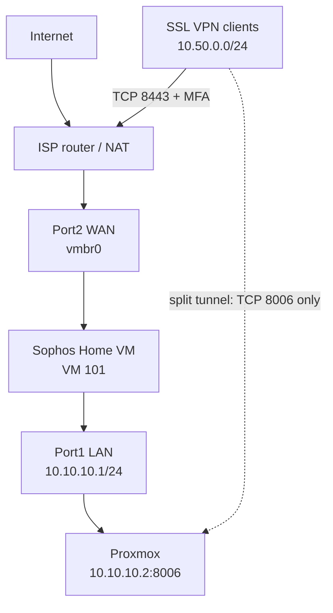

# CloudGenius Sophos Firewall Home Edition on Proxmox

[](#validated-baseline)
[](https://www.sophos.com/en-us/free-tools/sophos-xg-firewall-home-edition)
[](https://www.proxmox.com/)
[](#validated-baseline)

A reproducible home and educational lab that installs Sophos Firewall Home Edition from the software ISO on Proxmox VE. The lab uses Sophos as the routed security boundary for an isolated CloudGenius network and provides MFA-protected, least-privilege SSL VPN access to Proxmox.

> This is the **free, non-commercial Home Edition** workflow. It installs the Sophos software ISO directly and does not use the paid/evaluation KVM ZIP, imported QCOW2 disks, or a 30-day trial serial.

## Validated baseline

| Item | Validated value |
|---|---|
| Installer | `SW-22.0.1_MR-1-490.iso` |
| Firewall | SFOS 22.0.1 MR-1 Build 490 |
| Hypervisor | Proxmox VE 9.2.2 / KVM |
| VM | `SOPHOS-HOME-FW01`, VMID 101 |
| Compute | 4 vCPU, 6144 MB RAM |
| Disk | 80 GB |
| Port1 / LAN | `vmbr1`, `10.10.10.1/24` |
| Port2 / WAN | `vmbr0`, DHCP reservation |
| LAN DHCP | `10.10.10.100-10.10.10.200` |
| SSL VPN pool | `10.50.0.0/24` |
| SSL VPN transport | TCP 8443 |
| VPN authorization | MFA group, split tunnel, Proxmox TCP 8006 only |
| Recovery | Protected Proxmox stop-mode backup with ZSTD |

The public IP, WAN reservation, serial number, account email, usernames, MAC addresses, passwords, certificates, and OTP secrets are intentionally not stored here.

## Home Edition boundary

Sophos Firewall Home Edition is free for home, laboratory, and educational use. It is limited to **4 CPU cores and 6 GB RAM**. Review the current Sophos terms before using it for commercial services, production workloads, or paid training. This repository does not redistribute the Sophos ISO or license material.

The deployment script enforces the Home Edition compute limits:

- CPU: 2–4 cores
- Memory: 4096–6144 MB
- Disk: 32 GB or larger
- Two separate virtual NICs
- Proxmox QEMU guest-agent integration disabled (this is unrelated to a guest network)

## Architecture



The ISP router forwards only the required VPN transport to the Sophos WAN address. Proxmox TCP 8006 is **not** forwarded from the internet.

## Deploy

Prerequisites:

- The Home Edition software ISO in the Windows Downloads folder, named `SW-*.iso`
- Windows OpenSSH client (`ssh.exe` and `scp.exe`)
- Root SSH access to the target Proxmox node for deployment
- Existing, verified bridges for WAN and isolated LAN
- An ISO-capable Proxmox storage and an image-capable disk storage

Run from an elevated PowerShell prompt:

```powershell
.\scripts\Deploy-Sophos-Home-Firewall-Proxmox.ps1 `
  -ProxmoxHost <PROXMOX_HOST> `
  -ProxmoxNode <PROXMOX_NODE> `
  -DiskStorage <VM_DISK_STORAGE> `
  -IsoStorage local `
  -WanBridge vmbr0 `
  -LanBridge vmbr1 `
  -VmId 101
```

To pin the validated ISO explicitly:

```powershell
.\scripts\Deploy-Sophos-Home-Firewall-Proxmox.ps1 `
  -ProxmoxHost <PROXMOX_HOST> `
  -DiskStorage <VM_DISK_STORAGE> `
  -IsoFile "$env:USERPROFILE\Downloads\SW-22.0.1_MR-1-490.iso"
```

The script hashes the local ISO, verifies the uploaded copy, validates Proxmox storage and bridges, refuses to overwrite an existing VM, creates and starts the VM, and removes only incomplete resources created by the current failed run. It never changes Proxmox host networking.

The ISO installer remains interactive. In the Proxmox console, confirm the target disk, complete installation, eject the ISO, and boot from `scsi0`.

## Documentation

- [Installation and initial setup](docs/installation.md)
- [Validated architecture](docs/architecture.md)
- [Restricted SSL VPN with MFA](docs/remote-access-vpn.md)
- [Security controls](docs/security-controls.md)
- [Validation test plan](docs/test-plan.md)
- [Public evidence and secret handling](docs/evidence-guide.md)

## Security notes

- Never expose Proxmox TCP 8006 or SSH directly to the internet.
- Give each remote user an individual Sophos account, MFA token, and non-root Proxmox account.
- Use split tunneling and permit only named resources and services.
- Log the VPN-to-management firewall rule.
- Use a MASQ/SNAT rule only when the destination has no route back to the VPN pool.
- Remove temporary VPN portal forwarding when enrollment/downloads are complete.
- Keep a protected backup outside the VM's own disk.

## Official references

- [Sophos Firewall Home Edition](https://www.sophos.com/en-us/free-tools/sophos-xg-firewall-home-edition)
- [Sophos Firewall Home FAQ](https://community.sophos.com/sophos-xg-firewall/f/recommended-reads/137737/sophos-firewall-sophos-firewall-home-faq)
- [Sophos Firewall KVM requirements](https://docs.sophos.com/nsg/sophos-firewall/21.0/Help/en-us/webhelp/onlinehelp/VirtualAndSoftwareAppliancesHelp/KVM/)
- [Proxmox VE documentation](https://pve.proxmox.com/pve-docs/)

## Disclaimer

This is an independent educational lab, not an official Sophos or Proxmox project. Product software and licensing remain subject to the vendors' terms.
