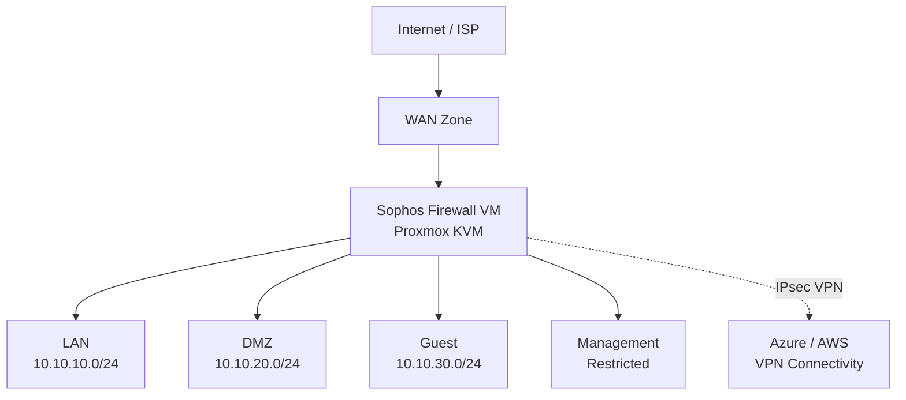

# CloudGenius Sophos Firewall on Proxmox Enterprise Lab

**Client overview:** [Client-facing case study](./CASE-STUDY.md)

[](#project-status)
[](https://www.proxmox.com/)
[](https://www.sophos.com/en-us/products/next-gen-firewall)
[](https://docs.sophos.com/nsg/sophos-firewall/22.0/Help/en-us/webhelp/onlinehelp/VirtualAndSoftwareAppliancesHelp/)
[](#security-capabilities)

> An enterprise-style cloud and network security lab deploying Sophos Firewall as a KVM virtual appliance on Proxmox VE, with segmented trust zones, controlled access, threat protection, secure administration, monitoring, and validation.

## Executive Summary

This project demonstrates how a virtual next-generation firewall can become the security control plane for a realistic hybrid enterprise lab. Sophos Firewall is deployed on Proxmox VE to protect workloads, enforce segmentation, control north-south and east-west traffic, provide secure remote connectivity, and generate operational security visibility.

The project is designed to demonstrate more than installation. It connects **business requirements, architecture, security controls, implementation, testing, operations, resilience, and documentation**.

## Business Problem

Flat lab networks provide limited isolation and make it difficult to demonstrate enterprise security practices. A compromised or misconfigured system may communicate freely with other workloads, while administrators have limited policy enforcement or centralized visibility.

This lab introduces a dedicated security boundary to:

- Separate trusted, untrusted, guest, management, and server workloads
- Apply least-privilege firewall policies between zones
- Control outbound internet access and inbound publishing
- Detect and prevent malicious or unauthorized activity
- Provide secure VPN access for administrators and students
- Produce logs and evidence for troubleshooting, monitoring, and governance
- Create a repeatable platform for cloud, cybersecurity, networking, and systems-administration training

## Target Architecture



> Network ranges are reference designs and will be confirmed against the final lab implementation.

## Security Capabilities

| Capability | Intended implementation | Business value |
|---|---|---|
| Network segmentation | Separate LAN, DMZ, guest, management, and WAN zones | Limits lateral movement and reduces blast radius |
| Least-privilege policy | Explicit inter-zone firewall rules | Prevents unnecessary access |
| NAT and publishing | Controlled outbound NAT and approved inbound services | Reduces uncontrolled exposure |
| Intrusion prevention | IPS policies for protected workloads | Detects and blocks exploit activity |
| Web and application control | Policy-based access and visibility | Reduces risky or unauthorized usage |
| Threat protection | Available Sophos security services under the active license | Improves detection and response |
| Secure administration | Restricted management sources and encrypted access | Protects the control plane |
| VPN | Remote-access and site-to-site scenarios | Enables secure hybrid connectivity |
| Logging and reporting | Firewall, security, authentication, and system logs | Supports monitoring, audit, and troubleshooting |
| Backup and recovery | Configuration backup and documented recovery | Improves operational resilience |

## Platform Baseline

The Sophos Firewall 22.0 documentation identifies the following virtual-appliance minimums:

| Resource | Sophos minimum | Planned lab allocation |
|---|---:|---:|
| vCPU | 1 | 2–4, subject to license |
| Memory | 4 GB | 4–8 GB, subject to license |
| vNIC | 2 | 4+ for separated zones |
| Primary disk | 32 GB | Imported primary QCOW2 disk |
| Report disk | 80 GB | Imported auxiliary/report QCOW2 disk |

Resource allocation must remain within the active Sophos license entitlement.

## Downloaded Build

- Package: `VI-22.0.1_MR-1.KVM-490.zip`
- Appliance type: KVM/QEMU
- Expected contents: primary and auxiliary QCOW2 disks
- Target hypervisor: Proxmox VE

The Sophos installation package and license material are **not stored in this repository**.

## Automated Deployment

The PowerShell workflow validates the Proxmox prerequisites and both Sophos QCOW2 disk images, creates the VM, imports and attaches the disks in the required order, maps Sophos Port1 to the LAN bridge and Port2 to the WAN bridge, validates the completed configuration, and leaves the appliance powered off for administrator review.

```powershell
.\scripts\Deploy-Sophos-Firewall-Proxmox.ps1 `
  -ProxmoxHost <PROXMOX_HOST> `
  -Storage <STORAGE_ID>
```

Create a disposable teaching VM:

```powershell
.\scripts\Deploy-Sophos-Firewall-Proxmox.ps1 `
  -ProxmoxHost <PROXMOX_HOST> `
  -Storage <STORAGE_ID> `
  -VmId 110 `
  -VmName SOPHOS-DEMO01
```

After the demonstration, review the cleanup defaults and run `scripts/Cleanup-Sophos-Demo.sh` on the Proxmox node. Vendor ZIP and disk images are excluded from source control.

## Project Status

**Current status: In Progress**

- [x] Create GitHub portfolio repository
- [x] Obtain Sophos Firewall KVM evaluation package
- [x] Confirm official Proxmox/KVM support
- [x] Establish architecture and security objectives
- [x] Extract and validate QCOW2 disks
- [x] Create Proxmox VM
- [x] Import primary and auxiliary disks
- [x] Configure WAN and trusted interfaces
- [ ] Complete initial registration and setup
- [ ] Configure segmented zones and firewall policies
- [ ] Configure NAT, IPS, web, and application policies
- [ ] Configure VPN use cases
- [ ] Enable logging, reporting, backup, and monitoring
- [ ] Execute validation test plan
- [ ] Add sanitized implementation evidence
- [ ] Change status to **Lab Validated**

## Documentation

- [Architecture and design](docs/architecture.md)
- [Proxmox installation runbook](docs/installation.md)
- [Security controls](docs/security-controls.md)
- [Validation test plan](docs/test-plan.md)
- [Evidence standards](docs/evidence-guide.md)

## Enterprise Outcomes

When complete, this project will demonstrate:

- Virtual firewall architecture on an enterprise hypervisor
- Secure network segmentation and policy enforcement
- Next-generation firewall capabilities
- Hybrid connectivity and VPN design
- Security monitoring and operational readiness
- Risk-based architecture decisions
- Reproducible documentation and validation
- Practical training capability for CloudGenius learners

## Security and Privacy

This public repository does not contain:

- Evaluation serial numbers or license files
- Passwords, API keys, certificates, or private keys
- Public IP addresses or administrative endpoints
- Terraform state or secrets
- Proprietary Sophos binaries
- Unsanitized production or personal data

All screenshots must be reviewed and sanitized before publication.

## Official References

- [Sophos Firewall 22.0 virtual appliance platforms and requirements](https://docs.sophos.com/nsg/sophos-firewall/22.0/Help/en-us/webhelp/onlinehelp/StartupHelp/Platforms/)
- [Sophos Firewall 22.0 cloud and virtual appliances](https://docs.sophos.com/nsg/sophos-firewall/22.0/Help/en-us/webhelp/onlinehelp/VirtualAndSoftwareAppliancesHelp/)
- [Sophos Firewall deployment on Proxmox VE](https://docs.sophos.com/nsg/sophos-firewall/22.0/Help/en-us/webhelp/onlinehelp/VirtualAndSoftwareAppliancesHelp/KVM/ProxmoxInstall/)
- [Sophos Firewall free trial](https://www.sophos.com/en-us/products/next-gen-firewall/free-trial)

## Disclaimer

This is an independent educational lab and is not an official Sophos or Proxmox project. Sophos, Sophos Firewall, Proxmox, and associated marks belong to their respective owners. Product software and licensing remain subject to the vendors' terms.

---

## Consulting relevance

This project demonstrates the combination of architecture, security engineering, virtualization, automation, and operational documentation required for firewall and hybrid-infrastructure engagements.

Typical consulting use cases include:

- firewall architecture and modernization;
- network segmentation and least-privilege policy;
- secure administration;
- VPN and hybrid connectivity;
- Proxmox / KVM infrastructure;
- lab-to-production design reviews;
- network-security automation and operational handoff.

**Consulting inquiries:** advisory@cloudgenius.ca · https://cloudgenius.ca
